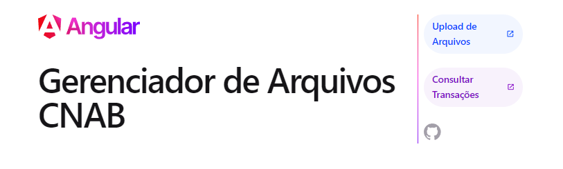
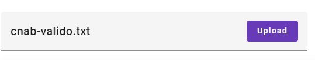
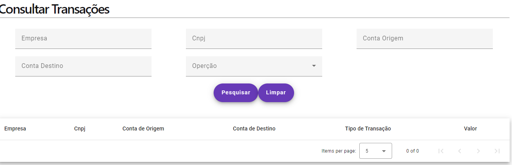

# Gerenciador de Arquivos Cnab  (Front-End)

### Sobre o Projeto

Exemplo de um projeto em Angular, onde crio uma interface para o usuario realizar o upload de um
arquivo contendo informações sobre transações bancarias de crédito, débito e transferencias. O usuairo
também pode realizar cosultas com filtros para obter os registros que foram salvos na base de dados.

#### 🔗 Link para o [@Back-End em Java-SpringBoot](https://github.com/leokashmir/cnab-processor-file)


## Tecnologias
<hr>
- NodeJs -> https://nodejs.org/en
- Angular - > https://angular.io/
- Angular Material - > https://material.angular.io/


  Este projeto foi gerado usando o [Angular CLI](https://github.com/angular/angular-cli) version 17.2.2.


## Premissas
<hr>
 - Ter o NodeJs Instalado. Para verificar execute os seguintes passos no WINDOWS:
   - Abra o menu iniciar
   - Em "pesquise" digite: cmd (Prompt de Comando)
   - Clique em Abrir
   - Com o prompt aberto, digite na linha de comando: <b>node --version</b>, aperte enter.
     Se o NodeJs estiver instalado, algo similar a isto ira aparecer:
    ```
    node --version
    v20.11.1
    ```
   Caso contrario, instale o NodeJs. Basta entrar no Link [@NodeJs](https://nodejs.org/en), baixar a versão instável,
   e seguir os passos que a pagina indica para a instalação.
 
 
 - Ter o Angular instalado. Se você já tem o NodeJs instalado, verifique se o Angular esta instalado executando 
este comando no Prompt: <b>ng version</b><br>
Se o Angular estiver instalado, algo similar a isto ira ser exibido:<br>
```
 ng version

     _                      _                 ____ _     ___
    / \   _ __   __ _ _   _| | __ _ _ __     / ___| |   |_ _|
   / △ \ | '_ \ / _` | | | | |/ _` | '__|   | |   | |    | |
  / ___ \| | | | (_| | |_| | | (_| | |      | |___| |___ | |
 /_/   \_\_| |_|\__, |\__,_|_|\__,_|_|       \____|_____|___|
                |___/


Angular CLI: 17.2.2
Node: 20.11.1
Package Manager: npm 10.2.4
OS: win32 x64

Angular: 17.2.3
... animations, common, compiler, compiler-cli, core, forms
... platform-browser, platform-browser-dynamic, platform-server
... router

Package                         Version
---------------------------------------------------------
@angular-devkit/architect       0.1702.2
@angular-devkit/build-angular   17.2.2
@angular-devkit/core            17.2.2
@angular-devkit/schematics      17.2.2
@angular/cdk                    17.2.1
@angular/cli                    17.2.2
@angular/material               17.2.1
@angular/ssr                    17.2.2
@schematics/angular             17.2.2
rxjs                            7.8.1
typescript                      5.3.3
zone.js                         0.14.4
```
<br>
Caso contrario, instale o Angular com digitando este comando: <b>npm install -g @angular/cli</b> 


# Executando o Projeto
<hr>

 - De um "Git Clone" no repositorio ou baixe e descompacte os arquivos do projeto em seu computador.
 - Entre na pasta do projeto atraves do Prompt de Comando, digite: <b>npm start</b> e de enter.
 - Ao finalizar a operação, a aplicação esta disponível em http://localhost:4200/, copie este endereço para seu
browser e tecle enter.

# Utilizando o Projeto
<hr>
  Na Primeira pagina da Aplicação o usuario tem a opção de 2 Menus. Upload de Arquivos e Consultar Transações:
  
 

  

  
### Upload de Arquivos
<hr>
  Para relizar o Upload basta clicar em: 

  
  
  clicar em "Selecionar Arquivo"

  

  Escolher o arquivo e clicar em Upload

  


 ### Pesquisa de Transações
 <hr> 
  Para realizar uma pesquisa clique em:


  Preencha ou não os filtros (se nenhum filtro for preenchido, a pesuisa retorna todas as transaçõe salvar) e clique em pesquisar:




## Documentação Tecnica:
<hr>

### Principais Classes da Aplicação
  - AppComponent
  - UploadfileComponent
  - PesquisaComponent
  - UploadService
  - PesquisaService

<br>

  ### AppComponent
A classe AppComponent é o componente principal da aplicação Angular. Este componente é responsável por gerenciar o layout e a navegação da aplicação.
<hr>

##### Propriedades
- <b>title: string</b>
Uma propriedade que armazena o título da aplicação.

##### Construtor
- constructor(router: Router)
O construtor da classe AppComponent recebe o serviço Router injetado, que é utilizado para a navegação dentro da aplicação.

##### Métodos
- redirectToRoute(route: string): void
Este método é chamado para redirecionar o usuário para uma rota específica da aplicação.

##### Parâmetros
- route: string: A rota para a qual o usuário deve ser redirecionado.
- items: { title: string, link: string }[]
Uma lista de objetos que representam os itens do menu de navegação da aplicação. Cada objeto contém um título (title) e uma rota (link) associada ao item do menu.

<br>

### UploadfileComponent

A classe UploadfileComponent é um componente do Angular utilizado para lidar com o upload de arquivos e exibir os resultados de transações.
<hr>

#### Propriedades

- <b> currentFile: File </b>   O arquivo atualmente selecionado para upload.

- <b>  fileName: string</b>  O nome do arquivo atualmente selecionado.

- <b> message: string</b>  Uma mensagem de sucesso ou informação sobre o resultado do upload.

- <b> messageErro: string</b> Uma mensagem de erro em caso de falha no upload.

- <b> responseSucesso: ResponseUpload</b> O objeto de resposta em caso de sucesso no upload.

- <b> responseError: ResponseErroUpload</b> O objeto de resposta em caso de erro no upload.

- <b> displayedColumns: string[]</b> As colunas a serem exibidas na tabela de transações.

- <b> displayedColumnsErros: string[]</b> As colunas a serem exibidas na tabela de erros.

- <b> dataSource: TransacoesModel[]</b> Os dados das transações a serem exibidos na tabela.

- <b> dataSourceErros: ErrosModel[]</b> Os dados dos erros a serem exibidos na tabela de erros.

- <b> transacoes$: Observable<ResponseUpload> </b> Um Observable que contém a resposta do upload.

- <b> flagExibir: boolean </b> Uma flag que controla quais os resultados das transações devem ser exibidos.


#### Construtor

 - constructor(uploadService: UploadService, spinner: NgxSpinnerService)

   -  Parâmetros
       - uploadService: UploadService: O serviço utilizado para o upload de arquivos.
       -  spinner: NgxSpinnerService: O serviço utilizado para exibir e esconder o spinner de carregamento.

#### Métodos

 - selectFile(event: any): void
    Este método é chamado quando um arquivo é selecionado pelo usuário. Ele atualiza o arquivo atual e o nome do arquivo exibido.

    - Parâmetros
   event: any: O evento de seleção de arquivo.


- upload(): void
Este método é chamado para iniciar o processo de upload do arquivo selecionado. Ele faz a chamada para o serviço de upload e trata as respostas de sucesso e erro.


- getType(type: string): TipoEnum | undefined
Este método recebe um tipo de transação como string e retorna o tipo correspondente definido no enum TipoEnum.

  - Parâmetros
    - type: string: O tipo de transação como string ('C', 'D' ou 'T').
    - Retorna
    - TipoEnum | undefined: O tipo de transação correspondente ou undefined se o tipo não for reconhecido.


<br>

### PesquisaComponent
A classe PesquisaComponent é responsável por gerenciar a funcionalidade de pesquisa de transações na aplicação Angular.<hr>


#### Propriedades


- <b> transacoes$: Observable< TransacoesModel[] > </b>  Um Observable que contém a lista de transações retornadas pela pesquisa.

- <b> companyName: string </b> O nome da empresa utilizado como critério de pesquisa.

- <b> companyId: string </b> O CNPJ da empresa utilizado como critério de pesquisa.

- <b> accountOrigin: string </b> O número da conta de origem utilizado como critério de pesquisa.

- <b> accountDestination: string </b> O número da conta de destino utilizado como critério de pesquisa.

- <b> message: string </b> Uma mensagem de informação sobre o resultado da pesquisa.

- <b> type: string </b> O tipo de transação utilizado como critério de pesquisa.

- <b> formControlPesquisa: FormGroup </b> Um objeto FormGroup que contém os controles do formulário de pesquisa.

- <b> erroMensagem: string </b> Uma mensagem de erro em caso de falha na pesquisa.

- <b> paginationModel: PaginationModel </b> Um objeto que contém informações sobre a paginação dos resultados da pesquisa.

- <b> types: { value: string, viewValue: string }[] </b> Uma lista de objetos que representam os tipos de transação disponíveis para seleção no formulário de pesquisa.

- <b> displayedColumns: string[] </b> As colunas a serem exibidas na tabela de resultados da pesquisa.

- <b> dataSource: MatTableDataSource< TransacoesModel > </b> A fonte de dados da tabela de resultados da pesquisa.


### Métodos
 - ngOnInit(): void
    - Um método do ciclo de vida do Angular que é chamado após a inicialização do componente. É utilizado para criar o formulário de pesquisa.

- pesquisarTransacoes(): void
  - Um método que é chamado para iniciar a pesquisa de transações com base nos critérios especificados no formulário. Ele utiliza o serviço de pesquisa para obter os resultados e atualiza a fonte de dados da tabela de resultados.

- createForm(): void
  - Um método que é chamado para criar o formulário de pesquisa utilizando o FormBuilder.

- limpar(): void
  - Um método que é chamado para limpar os critérios de pesquisa e redefinir a tabela de resultados e a paginação.

- getType(type: string): TipoEnum | undefined
  - Um método que recebe um tipo de transação como string e retorna o tipo correspondente definido no enum TipoEnum.

<br>


## UploadService

A classe UploadService é um serviço Angular responsável por lidar com o upload de arquivos para o servidor.
<hr>

### Propriedades

- <b> httpClient: </b> Um objeto HttpClient utilizado para fazer requisições HTTP para o servidor.
- <b> urlBase: </b> A URL base para as requisições de upload, obtida do ambiente.

### Construtor
- constructor(httpClient: HttpClient)
  - O construtor da classe UploadService recebe um objeto HttpClient injetado e o utiliza para inicializar a propriedade httpClient.

### Métodos

- upload(file: File): Observable<any>
  - Este método é responsável por fazer o upload de um arquivo para o servidor.
  - Parâmetros
    - file: O arquivo a ser enviado para o servidor.
  - Retorna
    - Um Observable que emite a resposta do servidor após o upload do arquivo


<br>  

## PesquisaService
A classe PesquisaService é um serviço Angular responsável por fazer requisições HTTP para obter transações com base em critérios de pesquisa.

<hr>


### Propriedades

- <b> httpClient: </b> Um objeto HttpClient utilizado para fazer requisições HTTP para o servidor.
- <b> urlBase: </b> A URL base para as requisições de upload, obtida do ambiente.

### Construtor
- constructor(httpClient: HttpClient)
  - O construtor da classe UploadService recebe um objeto HttpClient injetado e o utiliza para inicializar a propriedade httpClient.


### Métodos

- getTransacoes(pageNumber: number, pageSize: number, filtro: PesquisaFiltroModel): Observable<TransacoesModel[]>
  - Este método é responsável por fazer uma requisição HTTP para obter transações com base nos critérios de pesquisa especificados.
  - Parâmetros
    - pageNumber: O número da página de resultados desejada.
    -  pageSize: O tamanho da página de resultados desejada.
    - filtro: Um objeto PesquisaFiltroModel contendo os critérios de pesquisa.
  - Retorna
    - Um Observable que emite um array de objetos TransacoesModel, representando as transações encontradas de acordo com os critérios de pesquisa.


## Author
<hr>

[@leokashmir](https://www.github.com/leokashmir)

[](https://www.linkedin.com/in/leokashmir/)
